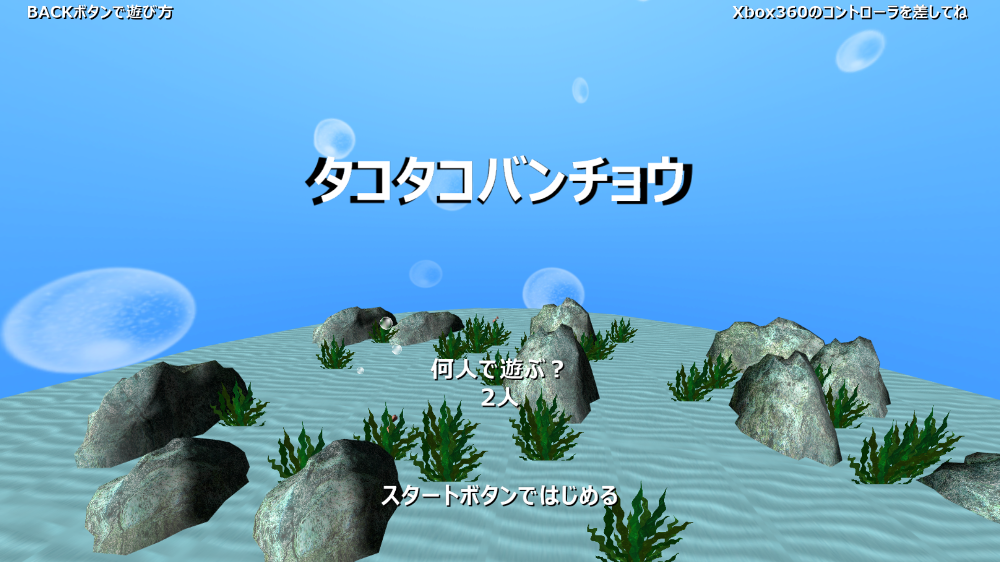
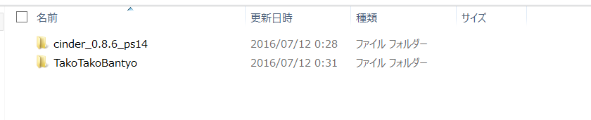

# タコタコバンチョウ

windowsのみ起動確認済み

## 開発詳細
**<開発環境>**  
Cinder0.8.6

**<制作人数>**  
2人  
プログラマー：1人  
デザイナー：1人  

**<制作期間>**  
3ヵ月

---------------------------------

## ゲームの起動方法
「Game」フォルダに入っている実行ファイルをダブルクリックで起動できます。

---------------------------------

## ビルドの仕方
1.[Cinder(0.8.6)](http://libcinder.org)をダウンロード。  
2.「cinder_0.8.6_ps14」フォルダを作成し、その下に上記でダウンロードしたものを置く。  
3.「cinder_0.8.6_ps14」フォルダと「TakoTakoBantyo」フォルダの階層を一緒にする。  

上記の構成になっていれば問題ないです。

以上。

